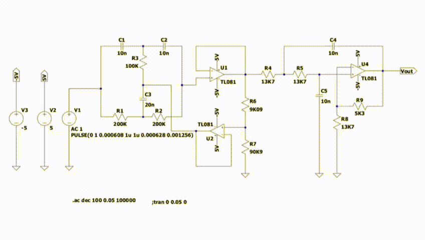
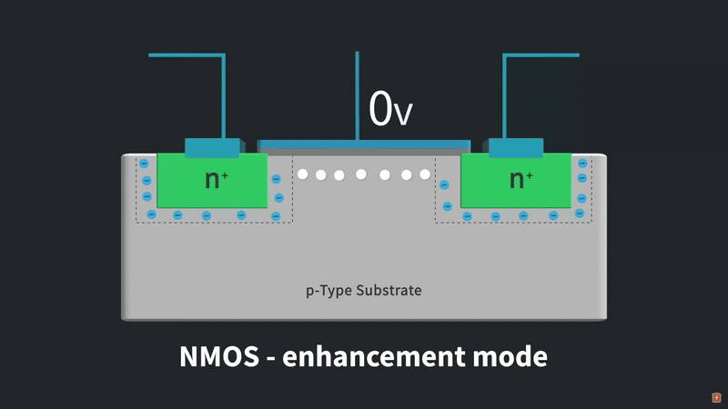

# Engineering Portfolio

A showcase of my engineering projects and technical work. This repository highlights my academic and practical experience in electronics and networking, demonstrating problem-solving skills and creativity in engineering challenges.

---

## Skills & Tools

**Electronics:** LTSpice, MOSFET/BJT modeling, Analog/Digital circuits, Component design,  
**Programming:** Python, Node.js, MATLAB, FreeCAD, C
**Networking:** Wireshark, TCP/IP, OSI, HTTP/SMTP/DNS  
**Other Tools:** Git, PDF Documentation, Project Planning & Management  

---

## Table of Contents

1. [3D Electronic Component Designs for PCB](#3d-electronic-component-designs-for-pcb)
2. [Microcontroller Projects](#microcontroller-projects)
3. [Microelectronic Circuits](#microelectronic-circuits)
4. [Application and Transport Layers with Wireshark](#application-and-transport-layers-with-wireshark)  
5. [Communication Network Fundamentals - Vol 1](#communication-network-fundamentals---vol-1)  
6. [Communication Network Fundamentals - Vol 2](#communication-network-fundamentals---vol-2)  
7. [Low-Pass Twin-T Notch Filter](#low-pass-twin-t-notch-filter)  
8. [MOSFET Memory Cell Programming](#mosfet-memory-cell-programming)  
9. [Project Planning](#project-planning)  
10. [Semiconductor Device Modeling](#semiconductor-device-modeling)  
11. [Voice Signal Characterization](#voice-signal-characterization)  

---

## 3D Electronic Component Designs for PCB

**Summary:** 3D models of electronic components I created because they are not available in standard PCB libraries.

  

[Download here](https://github.com/lucianafalcon/Engineering_Portfolio/tree/main/Component-Design)  
Files are in **.FCStd** and can be converted to **.STEP** for PCB software.

---

## Microcontroller Projects

Projects for the **STM32 NUCLEO-F103RB** development board.  
Covers basic I/O handling, analog acquisition, timer control, and PWM signal generation.

**Keypad & LCD Display – Interactive Menu**  
- Reads input from a matrix keypad  
- Displays information on an LCD
- Implements interactive menu navigation and option selection  

**ADC – Timer – PWM**  
- Analog-to-digital conversion using the STM32’s built-in ADC from a potentiometer and LDR  
- Timer configuration for precise PWM signal generation  
- Real-time LED brightness control based on analog input variation.
  
https://github.com/user-attachments/assets/b324980d-c6ee-4a99-994d-e11b691de072
  
[Download here](https://github.com/lucianafalcon/Engineering_Portfolio/tree/main/Microcontroller-Projects)  
Requirements
Board: STM32 NUCLEO-F103RB
IDE: STM32CubeIDE
Libraries: STM32 HAL (Hardware Abstraction Layer)

---

## Microelectronic circuits

Lab 1 – Operational Amplifiers: Applications and Limitations
Experimental analysis of analog circuits based on the LM741 op-amp.
Frequency response, slew rate, and non-ideal effects were characterized using LTSpice and practical measurements. Included amplifier, integrator, and rectifier implementations.

[TL1 Report](https://github.com/lucianafalcon/Engineering_Portfolio/blob/main/Microelectronic-Circuits/TL1.pdf) 

Lab 2 – Feedback Stages
Design and analysis of feedback amplifiers and phase-shift oscillators using BJT BC558B.
DC biasing, small-signal modeling, frequency response, and THD were compared between theory, simulation, and experiments, confirming the stabilizing effects of negative feedback.

 [TL2 Report](https://github.com/lucianafalcon/Engineering_Portfolio/blob/main/Microelectronic-Circuits/TL2.pdf)  

Lab 3 – Cascode MOSFET Amplifier: High-Frequency Characterization. Analysis of a dual-gate MOSFET BF966 configured as a cascode (common-source + common-gate).
DC operating points, small-signal parameters, voltage gain, and input/output resistances were determined analytically, simulated in LTSpice, and verified experimentally.

A full AC sweep was performed to compare measured and simulated Bode plots.
Instrumentation effects were analyzed: the 10× passive probe and coaxial cable reduced the measured high-frequency bandwidth due to added parasitic capacitance. Using an active probe significantly increased the upper cutoff frequency, matching theoretical predictions.

FFT measurements (oscilloscope and LTSpice .FOUR) were used to evaluate distortion, confirming linear operation and validating the amplifier model.

 [TL3 Report](https://github.com/lucianafalcon/Engineering_Portfolio/blob/main/Microelectronic-Circuits/TL3.pdf)  

---

## Application and Transport Layers with Wireshark

**Summary:** Observed and analyzed real network traffic to understand Application and Transport layer protocols in practice.

- **Application Layer:** Interfaces with the user; handles HTTP requests  
- **Transport Layer (TCP):** Ensures reliable end-to-end communication  
- **Tools:** Wireshark captures demonstrate request-response cycles and TCP reliability  

[Report](Application_and_Transport_Layers_with_Wireshark.pdf)  

---

## Communication Network Fundamentals - Vol 1

**Summary:** Technical summary of networking principles covering architectures, protocols, and performance metrics.

- **Topics:** OSI/TCP-IP, HTTP/SMTP/DNS, UDP/TCP, IP addressing, NAT, Subnetting, Network performance  
- **Illustrations:** Based on Kurose & Ross textbooks  
- **Purpose:** Provides a solid foundation for understanding networking concepts  

[Report](Communication_Network_Fundamentals_Vol_1.pdf)  

---

## Communication Network Fundamentals - Vol 2

**Summary:** Advanced topics in networking, including LANs, routing protocols, SDN, and physical layer theory.

- **Topics:** ARP, RIP, OSPF, Distance Vector, Link State, SDN concepts (OpenFlow, P4), Transmission media, Nyquist/Shannon theorems  

[Report](Communication_Network_Fundamentals_Vol_2.pdf)  

---

## Low-Pass Twin-T Notch Filter

**Summary:** Design and simulation of a filter to remove 79.5 Hz interference while allowing other signals to pass, useful for ECG devices.

  

- **Function:** Band-reject at 79.5 Hz, low-pass cutoff ~955 Hz  
- **Applications:** Cardiac monitoring, signal cleaning for accurate diagnostics  

[Report](Low-Pass_Twin-T_Notch_Filter.pdf)  

---

## MOSFET Memory Cell Programming

**Summary:** Simulation and analysis of floating-gate MOSFET memory cell programming using Fowler-Nordheim tunneling.

  

- **Tasks:**  
  - Current evolution and threshold voltage for VG = 11V  
  - Analysis for VG = 12V & 13V  
  - Constant current injection strategy and simulation  
- **Outcome:** Demonstrates advanced semiconductor knowledge and simulation skills  

[Report](MOSFET_Memory_Cell_Programming.pdf)  

---

## Project Planning

**Summary:** Comprehensive guide to planning and managing engineering projects.

- **Contents:** Project design, planning process, risk management, feasibility, lifecycle, Quality Function Deployment (QFD)  

[Report](Proyect_Planning.pdf)  

---

## Semiconductor Device Modeling

**Summary:** Complete analysis of diodes, BJTs, and N-Channel MOSFETs with simulations, analytical modeling, and real-world comparison.

- **Diode:** I-V curves, forward/reverse bias, small-signal modeling  
- **BJT:** Parameter extraction, biasing analysis, temperature effects  
- **MOSFET:** Custom model, amplifier design, distortion analysis, validation with BSP89  

[Report](Semiconductor_Device_Modeling.pdf)  

---

## Voice Signal Characterization

**Summary:** Analysis and transformation of speech signals using spectral and temporal techniques.

- **Methods:** FFT, STFT, TD-PSOLA, Phase Vocoder  
- **Applications:** Pitch shifting, speed modification, intelligibility preservation  

[Report](Voice_Signal_Characterization.pdf)  
